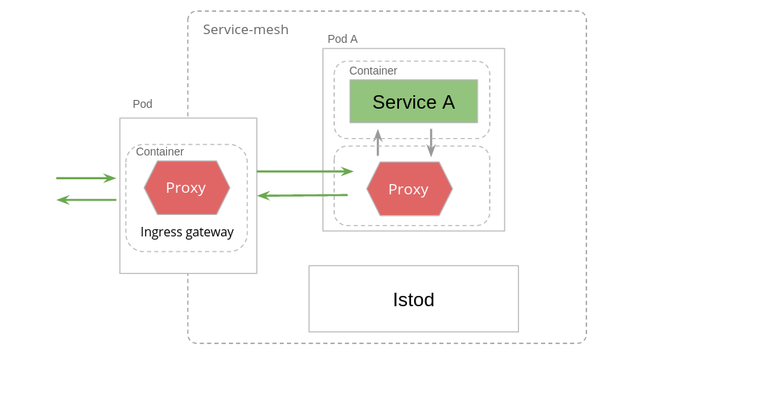

На этом шаге мы настроим service mesh согласно следующей схеме:

Давайте установим ServiceA:
`kubectl apply -f https://raw.githubusercontent.com/avsinsight/katacoda-scenarios/main/sc1/src/serviceA-v1-deployment.yml`{{execute}}

Применим Service для деплоймента выше:
`kubectl apply -f https://raw.githubusercontent.com/avsinsight/katacoda-scenarios/main/sc1/src/serviceA-srv.yml`{{execute}}

Создадим Gateway:
`kubectl apply -f https://raw.githubusercontent.com/avsinsight/katacoda-scenarios/main/sc1/src/serviceA-gw.yml`{{execute}}

Определим правило маршрутизации:
`kubectl apply -f https://raw.githubusercontent.com/avsinsight/katacoda-scenarios/main/sc1/src/inbound-to-serviceA-vs.yml`{{execute}}

Подробно тип манифестов выше рассмотрены в упражнении: `https://www.katacoda.com/artashesavetisyan/scenarios/sc1`{{copy}}

Проверим готовность подов:
`kubectl get pods --all-namespaces`{{execute}}

Все поды, за исключением katacoda-cloud-provider, должны иметь статус Running, дождитесь нужного статсуса (в зависисмоти от нагрузки на серверы Katacoda это время может сильно варьировать).

И наконец совершим GET запрос по адресу ingress-шлюза:
`curl -v http://$GATEWAY_URL/service-a`{{execute}}

В ответ на совершенный вызов на данном шаге мы должны видеть сообщение:
`Hello from ServiceA! Calling Producer Service... I/O error on GET request for "http://producer-internal-host:80/": producer-internal-host; nested exception is java.net.UnknownHostException: producer-internal-host`

Что произошло?

Мы совершили запрос в ingress-шлюз, который был перенаправлен в envoy-прокси пода с контейнером ServiceA. Далее запрос был маршрутизирован непосредственно в приложение ServiceA.

ServiceA, получив запрос, совершил запрос по адресу http://producer-internal-host:80/, однако данного хоста еще нет в service mesh, поэтому произошло исключение java.net.UnknownHostException. ServiceA подготовил ответ на внешний вызов и вернул его.

Проверим логи доступа Envoy ingress-шлюза:
`kubectl logs -l app=istio-ingressgateway -n istio-system -c istio-proxy`{{execute}}

Проверим логи доступа Envoy в поде с бизнес сервисом:
`kubectl logs -l app=service-a-app -c istio-proxy`{{execute}}

Перейдем далее.