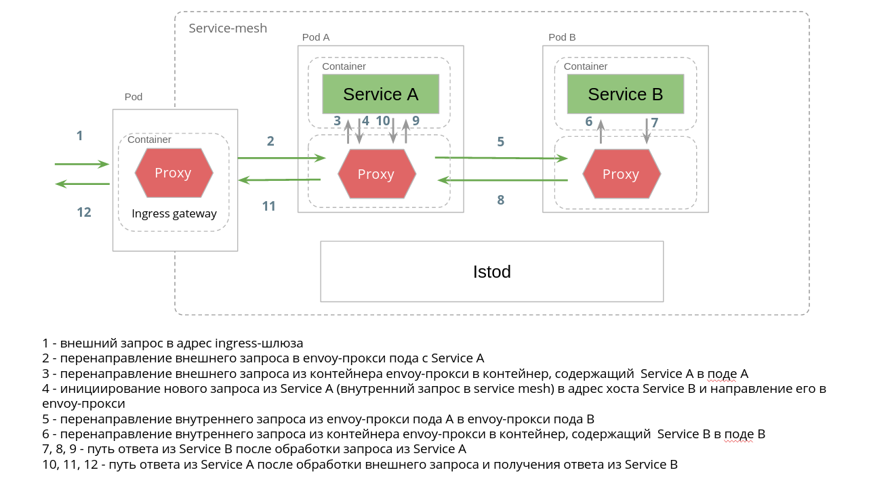

На этом шаге мы направим исходящие запросы из ServiceA в ServiceB. На схеме это выглядет слудующим образом:



Давайте установим ServiceB:
`kubectl apply -f https://raw.githubusercontent.com/avsinsight/katacoda-scenarios/main/sc1/src/service-b-deployment.yml`{{execute}}

Применим манифест Service для деплоймента выше:
`kubectl apply -f https://raw.githubusercontent.com/avsinsight/katacoda-scenarios/main/sc1/src/producer-internal-host.yml`{{execute}}

Определим правило маршрутизации запросов из ServiceA на хост producer-internal-host.

Россмотрим producer-internal-host-vs:
```
apiVersion: networking.istio.io/v1alpha3
kind: VirtualService
metadata:
  name: producer-internal-host-vs
spec:
  hosts:
    - producer-internal-host
  gateways:
    - mesh
  http:
    - route:
        - destination:
            host: producer-internal-host
            port:
              number: 80
```

Применим данный манифест
`kubectl apply -f https://raw.githubusercontent.com/avsinsight/katacoda-scenarios/main/sc1/src/producer-internal-host-vs.yml`{{execute}}

Проверим готовность подов:
`kubectl get pods --all-namespaces`{{execute}}

Повторим совершенный на предидущем шаге GET запрос по адресу ingress-шлюза:
`curl -v http://$GATEWAY_URL/service-a`{{execute}}

В случае успеха ответ на совершенный вызов должен быть таким:
`Hello from ServiceA! Calling Producer Service... Received response from Producer Service: Hello from ServiceB!`

Для сравнения аналогичный вызов на предыдущем шаге возвращал такой ответ:
`Hello from ServiceA! Calling Producer Service... I/O error on GET request for "http://producer-internal-host:80/": producer-internal-host; nested exception is java.net.UnknownHostException: producer-internal-host`

Теперь в кластере существуют поставщик данных для ServiceA, который связан с хостом producer-internal-host, поэтому ServiceA на этом шаге получает корректный ответ.

Проверим логи доступа Envoy ingress-шлюза:
`kubectl logs -l app=istio-ingressgateway -n istio-system -c istio-proxy`{{execute}}

Проверим логи доступа Envoy в поде с бизнес сервисом ServiceA:
`kubectl logs -l app=service-a-app -c istio-proxy`{{execute}}

Проверим логи доступа Envoy в поде с бизнес сервисом ServiceB:
`kubectl logs -l app=service-b-app -c istio-proxy`{{execute}}

Перейдем далее.