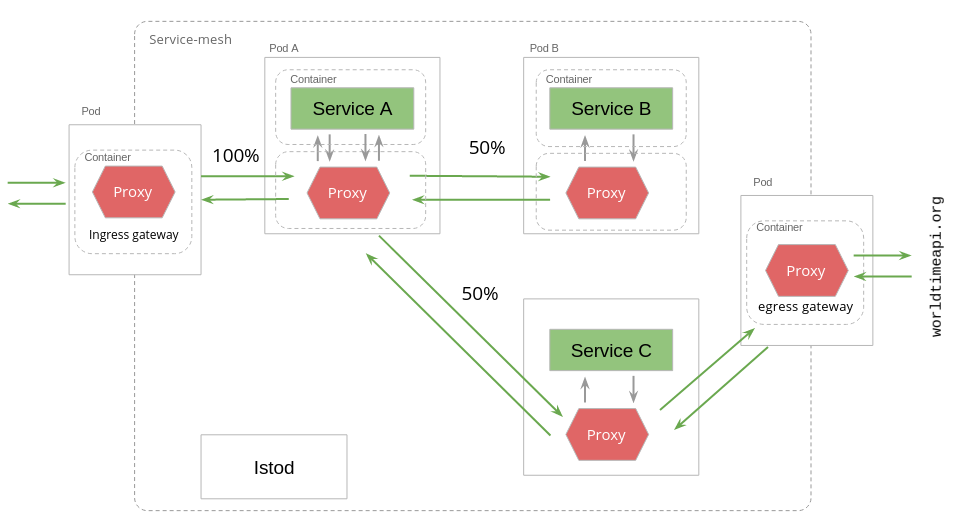

На данном шаге мы откроем исходящий трафик из service mesh для получения ответов из worldtimeapi.org на запросы из ServiceC.

Схема service mesh, в соотвесвтии с которой будем настраивать наш кластер:



Существует 3 подхода к открытию исходящего трафика в Istio:

1) открытый доступ из любого пода на любой внешний хост по умолчанию - удобный подход для разработки, но не безопасный и не контролируемый, поэтому в промышленной эксплуатации применяется редко.

2) Отсутствие доступа на любой внешний хост исключая те, которые явно указаны в манифесте ServiceEntry.

3) Направление трафика на внешний хост через единый egress шлюз - позволяет обогатить весь исходящий трафик из кластера требуемой логикой (например обогатить заголовками для аутентификации запросов), мониторировать и контролировать его. Данный подход применяться в больших промышленных системах.

Реализуем третий подход.

Развернем egress-шлюз, выполнив команду авто-конфигруации Isto:

`istioctl install --set components.egressGateways[0].name=istio-egressgateway --set components.egressGateways[0].enabled=true`{{execute}}

Просмотрим манифест worldtime-host-se.yml:
```
apiVersion: networking.istio.io/v1alpha3
kind: ServiceEntry
metadata:
  name: worldtime-host-se
spec:
  hosts:
    - worldtimeapi.org
  ports:
    - number: 80
      name: http
      protocol: HTTP
  resolution: DNS
  location: MESH_EXTERNAL
```

Ключи spec.hosts, spec.ports[0].number, spec.ports[0].protocol содержат значение имени хоста, запросы на который следует разрешить, номера его порта, вид протокола.

Применим ServiceEntry:
`kubectl apply -f https://raw.githubusercontent.com/avsinsight/katacoda-scenarios/main/sc1/src/worldtime-host-se.yml`{{execute}}

Создадим манифест Gateway для исходящего трафика:
`kubectl apply -f https://raw.githubusercontent.com/avsinsight/katacoda-scenarios/main/sc1/src/worldtime-gw.yml`{{execute}}

Рассмотрим новое правило маршрутизации:
```
apiVersion: networking.istio.io/v1alpha3
kind: VirtualService
metadata:
  name: outbound-srv-c-to-worldtime-vs
spec:
  hosts:
    - worldtimeapi.org
  gateways:
    - istio-egressgateway
    - mesh
  http:
    - match:
        - gateways:
            - mesh
          port: 80
      route:
        - destination:
            host: istio-egressgateway.istio-system.svc.cluster.local
            port:
              number: 80
    - match:
        - gateways:
            - istio-egressgateway
          port: 80
      route:
        - destination:
            host: worldtimeapi.org
            port:
              number: 80
```

В соответствии с этим манифестом новое правило будет работать при вызовах на хост worldtimeapi.org из шлюза istio-egressgateway, а также из любого envoy-прокси в неймспейсе. Если вызов прийдет из любого envoy-прокси в неймспейсе (кроме istio-egressgateway), произойдет его перенаправление на хост istio-egressgateway. Если поступит запрос из istio-egressgateway, то он будет направлен на хост worldtimeapi.org. Таким образом достигается сосредоточение всех исходящих вызовов в кластере на шлюз istio-egressgateway.

Применим это правило:
`kubectl apply -f https://raw.githubusercontent.com/avsinsight/katacoda-scenarios/main/sc1/src/outbound-srv-c-to-worldtime-vs.yml`{{execute}}

Теперь исходящий трафик направляется через egress-шлюз и достигает worldtimeapi.org.

Совершим несколько запросов на ingress-шлюз, напомню, запросы из ServiceA все также балансируются между ServiceB и ServiceC:

`curl -v http://$GATEWAY_URL/service-a`{{execute}}

На этом шаге все ответы должны быть успешные и иметь вид (если поступили из ServiceB):
`Hello from ServiceA! Calling Producer Service... Received response from Producer Service: Hello from ServiceB!`

Или из ServiceC:
```
Hello from ServiceA! Calling Producer Service... Received response from Producer Service: Hello from ServiceC! Calling worldtimeapi.org API... Received response from worldtimeapi.org: Europe/Amsterdam
Europe/Andorra
Europe/Astrakhan
Europe/Athens
Europe/Belgrade
Europe/Berlin
Europe/... (printed only 100 symbols from response body beginning)
```

Обратите внимание, что в части ответа из ServiceC присутвует ответ из worldtimeapi.org по запросу `http://worldtimeapi.org/api/timezone/Europe`

Перейдем далее.