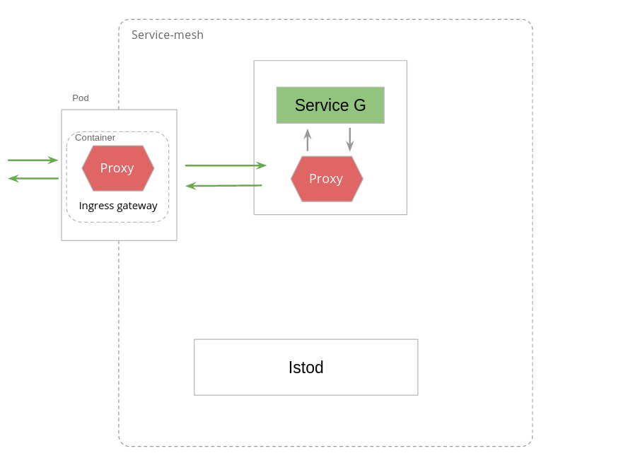

На этом шаге мы установим ServiceG и настроим service mesh согласно следующей схеме:

Давайте установим ServiceG:
`kubectl apply -f https://raw.githubusercontent.com/avsinsight/katacoda-scenarios/main/sc3/src/service-g-deployment.yml`{{execute}}

Применим Service для деплоймента выше:
`kubectl apply -f https://raw.githubusercontent.com/avsinsight/katacoda-scenarios/main/sc3/src/service-g-srv.yml`{{execute}}

Создадим Gateway для маршрутизации запросов из ingress-шлюза в ServiceG:
`kubectl apply -f https://raw.githubusercontent.com/avsinsight/katacoda-scenarios/main/sc3/src/service-g-gw.yml`{{execute}}

И применим правило маршрутизации:
`kubectl apply -f https://raw.githubusercontent.com/avsinsight/katacoda-scenarios/main/sc3/src/inbound-to-service-g-vs.yml`{{execute}}

Проверим готовность подов:
`kubectl get pods --all-namespaces`{{execute}}

Все поды, за исключением katacoda-cloud-provider, должны иметь статус Running, дождитесь нужного статсуса (в зависисмоти от нагрузки на серверы Katacoda это время может сильно варьировать).

И наконец совершим GET запрос по адресу ingress-шлюза:
`curl -v http://$GATEWAY_URL/service-g`{{execute}}

В ответе на совершенный вызов на данном шаге мы должны видеть сообщение:
`Hello from ServiceG! Calling master system API... 502 Bad Gateway: [no body]`

Что произошло?

Мы совершили запрос в ingress-шлюз, который был перенаправлен в envoy-прокси пода с контейнером ServiceG. Далее запрос был маршрутизирован непосредственно в приложение ServiceG.

ServiceG, получив запрос, совершил запрос по адресу http://www.oracle.com/index.html, однако, на данном шаге исходящие запросы из нашего кластера запрещены, поэтому в ответе мы видим `502 Bad Gateway: [no body]`.

Проверим логи доступа Envoy ingress-шлюза:
`kubectl logs -l app=istio-ingressgateway -n istio-system -c istio-proxy`{{execute}}

Проверим логи доступа Envoy в поде с бизнес сервисом:
`kubectl logs -l app=service-g-app -c istio-proxy`{{execute}}

Перейдем далее.