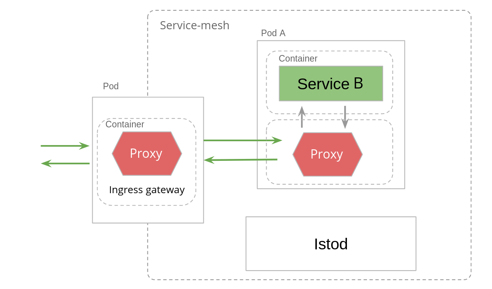

В данном упражнении мы установим ServiceB и настроим входящий трафик.

Схема создаваемой конфигурации сети:

Давайте установим ServiceB:
`kubectl apply -f https://raw.githubusercontent.com/avsinsight/katacoda-scenarios/main/sc1/src/service-b-deployment.yml`{{execute}}

Применим Service для деплоймента выше:
`kubectl apply -f https://raw.githubusercontent.com/avsinsight/katacoda-scenarios/main/sc1/src/producer-internal-host.yml`{{execute}}

Создадим Gateway для маршрутизации запросов из ingress-шлюза в ServiceB:
`kubectl apply -f https://raw.githubusercontent.com/avsinsight/katacoda-scenarios/main/sc1/src/service-b-gw.yml`{{execute}}

И применим правило маршрутизации:
`kubectl apply -f https://raw.githubusercontent.com/avsinsight/katacoda-scenarios/main/sc1/src/inbound-to-service-b-vs.yml`{{execute}}

Подробно тип манифестов выше рассмотрены в упражнении: `https://www.katacoda.com/artashesavetisyan/scenarios/sc1`{{copy}}

Проверим готовность подов:
`kubectl get pods --all-namespaces`{{execute}}

Все поды, за исключением katacoda-cloud-provider, должны иметь статус Running, дождитесь нужного статсуса (в зависисмоти от нагрузки на серверы Katacoda это время может сильно варьировать).

И наконец совершим GET запрос по адресу ingress-шлюза:
`curl -v http://$GATEWAY_URL/service-b`{{execute}}

В случае успеха в теле ответа мы должны видеть сообщение: `Hello from ServiceB!`

Перейдем к следующему шагу.

