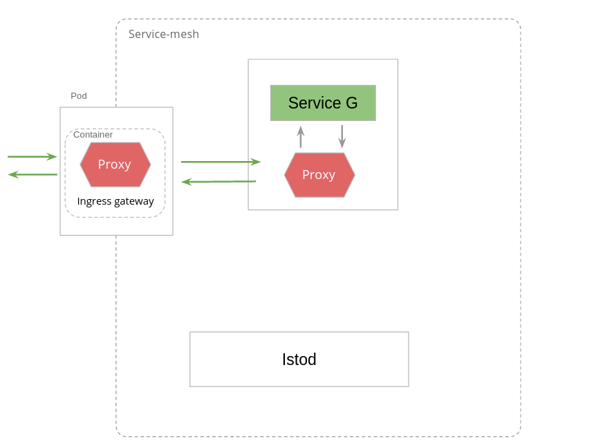

На этом шаге мы установим ServiceC и настроим service mesh согласно следующей схеме:

Генерация сертификатов

`openssl req -x509 -sha256 -nodes -days 365 -newkey rsa:2048 -subj '/O=example Inc./CN=istio-ingressgateway.istio-system.svc.cluster.local' -keyout istio-ingressgateway.key -out istio-ingressgateway.crt`{{execute}}

`openssl req -out local.istio-ingressgateway.csr -newkey rsa:2048 -nodes -keyout local.istio-ingressgateway.key -subj "/CN=istio-ingressgateway.istio-system.svc.cluster.local/O=My organization"`{{execute}}

`openssl x509 -req -days 365 -CA istio-ingressgateway.crt -CAkey istio-ingressgateway.key -set_serial 0 -in local.istio-ingressgateway.csr -out local.istio-ingressgateway.crt`{{execute}}

`kubectl create -n istio-system secret tls ingressgateway-cred --key=local.istio-ingressgateway.key --cert=local.istio-ingressgateway.crt`{{execute}}

Установим ServiceC:
`kubectl apply -f service-c-deployment.yml`{{execute}}

Применим манифест Service для деплоймента ServiceC:
`kubectl apply -f service-c-srv.yml`{{execute}}

Применим манифест Gateway:
`kubectl apply -f ingress-gw.yml`{{execute}}

Применим VirtualService:
`kubectl apply -f inbound-to-service-c-vs.yml`{{execute}}

Проверим готовность подов:
`kubectl get pods --all-namespaces`{{execute}}

Все поды должны иметь статус Running, дождитесь нужного статсуса.

И наконец совершим GET запрос по адресу ingress-шлюза:
`curl -v http://$GATEWAY_URL/service-c`{{execute}}

В ответе на совершенный вызов на данном шаге мы должны видеть сообщение:
`Hello from ServiceC! Calling master system API... 404 Not Found: [no body]`

Что произошло?

Мы совершили запрос в ingress-шлюз, который был перенаправлен в envoy-прокси пода с контейнером ServiceC. Далее запрос был маршрутизирован непосредственно в приложение ServiceC.

ServiceC, получив запрос, совершил запрос по адресу http://istio-ingressgateway.istio-system.svc.cluster.local/service-ext, однако, на данном шаге за этим адресом нет развернутого сервиса.

Проверим логи доступа Envoy ingress-шлюза:
`kubectl logs -l app=istio-ingressgateway -n istio-system -c istio-proxy`{{execute}}

Проверим логи доступа Envoy в поде с бизнес сервисом:
`kubectl logs -l app=service-c-srv -c istio-proxy`{{execute}}

Перейдем далее.